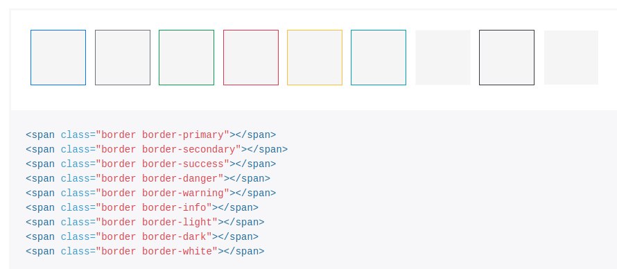
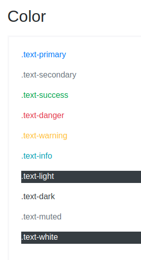
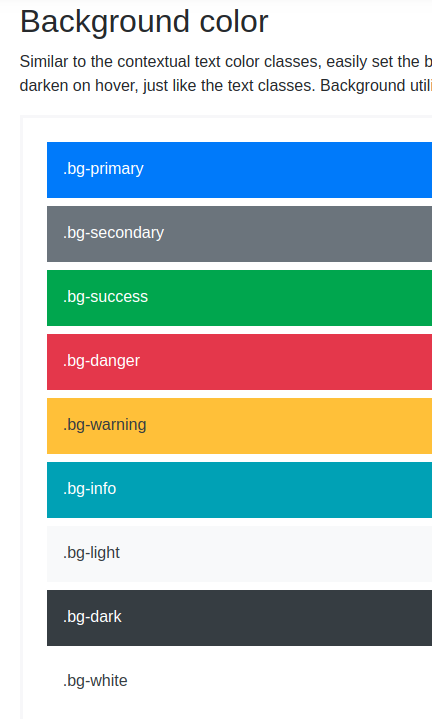

**Xiang Wang @ 2016-11-16 23:11:08**

[官方文档](https://getbootstrap.com/docs/4.3/getting-started/introduction/)

# get started
* css
```
<link rel="stylesheet" href="https://stackpath.bootstrapcdn.com/bootstrap/4.3.1/css/bootstrap.min.css" integrity="sha384-ggOyR0iXCbMQv3Xipma34MD+dH/1fQ784/j6cY/iJTQUOhcWr7x9JvoRxT2MZw1T" crossorigin="anonymous">
```
* js
```html
<!--不完整版的jquery-->
<script src="https://code.jquery.com/jquery-3.3.1.slim.min.js" integrity="sha384-q8i/X+965DzO0rT7abK41JStQIAqVgRVzpbzo5smXKp4YfRvH+8abtTE1Pi6jizo" crossorigin="anonymous"></script>
<!--或者使用完整版的jquery-->
<script
  src="https://code.jquery.com/jquery-3.4.0.min.js"
  integrity="sha256-BJeo0qm959uMBGb65z40ejJYGSgR7REI4+CW1fNKwOg="
  crossorigin="anonymous"></script>
<script src="https://cdnjs.cloudflare.com/ajax/libs/popper.js/1.14.7/umd/popper.min.js" integrity="sha384-UO2eT0CpHqdSJQ6hJty5KVphtPhzWj9WO1clHTMGa3JDZwrnQq4sF86dIHNDz0W1" crossorigin="anonymous"></script>
<script src="https://stackpath.bootstrapcdn.com/bootstrap/4.3.1/js/bootstrap.min.js" integrity="sha384-JjSmVgyd0p3pXB1rRibZUAYoIIy6OrQ6VrjIEaFf/nJGzIxFDsf4x0xIM+B07jRM" crossorigin="anonymous"></script>
```
* [引用模板](./basic.html)


# Content  
## Reboot  

## [typography](https://getbootstrap.com/docs/4.1/content/typography/)
the look of text
* Heading
* display heading
* lead
* inline text elements
    * mark
    * del
    * s
    * ins
    * u
    * small
    * strong
    * em
* abbreviations
* [blockquotes](https://getbootstrap.com/docs/4.1/content/typography/#blockquotes)  
use `blockquotes` to represent blockquote
    * example
    ```
    <blockquote class="blockquote">
      <p class="mb-0">Lorem ipsum dolor sit amet, consectetur adipiscing elit. Integer posuere erat a ante.</p>
    </blockquote>
    ```
    * naming a source
    ```
    <blockquote class="blockquote">
      <p class="mb-0">Lorem ipsum dolor sit amet, consectetur adipiscing elit. Integer posuere erat a ante.</p>
      <footer class="blockquote-footer">Someone famous in <cite title="Source Title">Source Title</cite></footer>
    </blockquote>
    ```
    * alignment
    ```
    <blockquote class="blockquote text-right">
      <p class="mb-0">Lorem ipsum dolor sit amet, consectetur adipiscing elit. Integer posuere erat a ante.</p>
      <footer class="blockquote-footer">Someone famous in <cite title="Source Title">Source Title</cite></footer>
    </blockquote>
    ```

## Code

## [Images](https://getbootstrap.com/docs/4.1/content/images/)
* use `.img-fluid` to make a responsive image
```

```
* user `.img-thumbnail` to make a image rounded by 1px  
``
* Aligning Images
    * rounded
    * float-left|float-right
    * mx-auto
    * d-block

## Tables
```
<table class="table">
  <thead>
    <tr>
      <th scope="col">#</th>
      <th scope="col">First</th>
      <th scope="col">Last</th>
      <th scope="col">Handle</th>
    </tr>
  </thead>
  <tbody>
    <tr>
      <th scope="row">1</th>
      <td>Mark</td>
      <td>Otto</td>
      <td>@mdo</td>
    </tr>
    <tr>
      <th scope="row">2</th>
      <td>Jacob</td>
      <td>Thornton</td>
      <td>@fat</td>
    </tr>
    <tr>
      <th scope="row">3</th>
      <td>Larry</td>
      <td>the Bird</td>
      <td>@twitter</td>
    </tr>
  </tbody>
</table>
```
* Striped rows
Use `.table-striped` to add zebra-striping  使用 `.table-striped` 来产生间隔条纹
    * Change the color:
    ```
    .table-striped>tbody>tr:nth-child(odd)>td,
    .table-striped>tbody>tr:nth-child(odd)>th {
      background-color: red; // Choose your own color here
    }
    ```


## Figures


# [Components](./components组件.md)

## [Buttons 按钮](https://getbootstrap.com/docs/4.1/components/buttons/)
* Example  

```
<button type="button" class="btn btn-primary">Primary</button>
<button type="button" class="btn btn-secondary">Secondary</button>
<button type="button" class="btn btn-success">Success</button>
<button type="button" class="btn btn-danger">Danger</button>
<button type="button" class="btn btn-warning">Warning</button>
<button type="button" class="btn btn-info">Info</button>
<button type="button" class="btn btn-light">Light</button>
<button type="button" class="btn btn-dark">Dark</button>
<button type="button" class="btn btn-link">Link</button>
```
* 样式
    * btn-outline-success: **边框**颜色

## [Carousel 轮播图](https://getbootstrap.com/docs/4.3/components/carousel/)

### How it works
### Example
```
<div id="carouselExampleSlidesOnly" class="carousel slide" data-ride="carousel">
  <div class="carousel-inner">
    <div class="carousel-item active">
        
    </div>
    <div class="carousel-item">
      
    </div>
    <div class="carousel-item">
      
    </div>
  </div>
</div>
```

## [Dropdowns](https://getbootstrap.com/docs/4.1/components/dropdowns/)
* Example
```
<div class="dropdown">
  <button class="btn btn-secondary dropdown-toggle" type="button" id="dropdownMenuButton" data-toggle="dropdown" aria-haspopup="true" aria-expanded="false">
    Dropdown button
  </button>
  <div class="dropdown-menu" aria-labelledby="dropdownMenuButton">
    <a class="dropdown-item" href="#">Action</a>
    <a class="dropdown-item" href="#">Another action</a>
    <a class="dropdown-item" href="#">Something else here</a>
  </div>
</div>
```
* Methods
```
$().dropdown('toggle')
```

## [Forms表单](./form表单.md)
## [List group](https://getbootstrap.com/docs/4.1/components/list-group/)
* [custom content](https://getbootstrap.com/docs/4.1/components/list-group/#custom-content)
通过在 .ligt-group-item 里面加一个 .row来做内部的自适应
```
<div class="list-group">
    <a class="list-group-item list-group-item-action">
        <div class="row">
        </div>
    </a>
    ...
</div>
```
或者
```html
<div class="list-group">
  <a href="#" class="list-group-item list-group-item-action flex-column align-items-start active">
    <div class="d-flex w-100 justify-content-between">
      <h5 class="mb-1">List group item heading</h5>
      <small>3 days ago</small>
    </div>
    <p class="mb-1">Donec id elit non mi porta gravida at eget metus. Maecenas sed diam eget risus varius blandit.</p>
    <small>Donec id elit non mi porta.</small>
  </a>
  <a href="#" class="list-group-item list-group-item-action flex-column align-items-start">
    <div class="d-flex w-100 justify-content-between">
      <h5 class="mb-1">List group item heading</h5>
      <small class="text-muted">3 days ago</small>
    </div>
    <p class="mb-1">Donec id elit non mi porta gravida at eget metus. Maecenas sed diam eget risus varius blandit.</p>
    <small class="text-muted">Donec id elit non mi porta.</small>
  </a>
  <a href="#" class="list-group-item list-group-item-action flex-column align-items-start">
    <div class="d-flex w-100 justify-content-between">
      <h5 class="mb-1">List group item heading</h5>
      <small class="text-muted">3 days ago</small>
    </div>
    <p class="mb-1">Donec id elit non mi porta gravida at eget metus. Maecenas sed diam eget risus varius blandit.</p>
    <small class="text-muted">Donec id elit non mi porta.</small>
  </a>
</div>
```

## [Modal](./modal模态框.md)
弹出一个窗口让用户确认或者操作

## [Navs](https://getbootstrap.com/docs/4.1/components/navs/)
* [example](./navs.html)
```html
    <ul class="nav">
      <li class="nav-item">
        <a class="nav-link active" href="#">Active</a>
      </li>
      <li class="nav-item">
        <a class="nav-link" href="#">Link</a>
      </li>
      <li class="nav-item">
        <a class="nav-link" href="#">Link</a>
      </li>
      <li class="nav-item">
        <a class="nav-link disabled" href="#">Disabled</a>
      </li>
    </ul>
```
* useful class:
    * `.nav`: 使用nav
    * `.active`: 激活状态
    * `.disabled`: 无法点击
    * `.justify-content-center | .justify-content-end`: 导航栏位置
    * `.flex-column`: 竖直的导航栏
    * `.nav-tabs`: 分页标签样式
    * `.nav-pills`: 片状样式
    * `.nav-fill`: 填充状态
    * `.nav-justifyied`: 统一大小

## [Navbar](./components组件.md#Navbar)
导航栏，用来导航到其他页面

## [Scrollspy](https://getbootstrap.com/docs/4.0/components/scrollspy/)
* [example](./scrollsby.html)
```
<nav id="navbar-example2" class="navbar navbar-light bg-light">
  <a class="navbar-brand" href="#">Navbar</a>
  <ul class="nav nav-pills">
    <li class="nav-item">
      <a class="nav-link" href="#fat">@fat</a>
    </li>
    <li class="nav-item">
      <a class="nav-link" href="#mdo">@mdo</a>
    </li>
    <li class="nav-item dropdown">
      <a class="nav-link dropdown-toggle" data-toggle="dropdown" href="#" role="button" aria-haspopup="true" aria-expanded="false">Dropdown</a>
      <div class="dropdown-menu">
        <a class="dropdown-item" href="#one">one</a>
        <a class="dropdown-item" href="#two">two</a>
        <div role="separator" class="dropdown-divider"></div>
        <a class="dropdown-item" href="#three">three</a>
      </div>
    </li>
  </ul>
</nav>
<div data-spy="scroll" data-target="#navbar-example2" data-offset="0">
  <h4 id="fat">@fat</h4>
  <p>...</p>
  <h4 id="mdo">@mdo</h4>
  <p>...</p>
  <h4 id="one">one</h4>
  <p>...</p>
  <h4 id="two">two</h4>
  <p>...</p>
  <h4 id="three">three</h4>
  <p>...</p>
</div>
```
* How it works:  
When spying on elements other than the `<body>`, be sure to have a `height` set and `overflow-y: scroll;` applied.


# Utilities [官网](https://getbootstrap.com/docs/4.0/utilities/borders/)

## [Borders](https://getbootstrap.com/docs/4.0/utilities/borders/)
* Border-subtractive
    * border
    * border-top
    * border-right
    * border-bottom
    * border-left
* Border-color:

* Border-radius:
    * rounded
    * rounded-top
    * rounded-left
    * rounded-circle
    * rounded-0

## [Colors](https://getbootstrap.com/docs/4.0/utilities/colors/)
* Color  

* Background  


## [Display](https://getbootstrap.com/docs/4.1/utilities/display/)
* inline

## [flex](https://getbootstrap.com/docs/4.1/utilities/flex/)
* example:
```
format: d(-breakpoint)(-inline)?-flex
<div class="d-flex p-2 bd-highlight">I'm a flexbox container!</div>
<div class="d-inline-flex p-2 bd-highlight">I'm and inline flexbox container!</div>
```
* direction:
    * `flex(-breakpoint)-row(-reverse)?`: `flex-sm-row-rever`
    * `flex(-breakpoint)-column(-reverse)?`: `flex-md-column`
* Justify-content: *how the display in the main axis*
    * `.justify-content(-breakpoint)-|end|center|between|around`
* Align-items: *how the display in the multi main axis*
    * `.align-items(-breakpoint)-start|end|center|baseline|stretch`
* auto margins
    * `mr-auto`: pushing items to the right
    * `ml-auto`: pushing items to the left
* fill: *use .flex-fill to fore them into equal widths* `.flex(-breakpoint)-fill`
使用flex-fill来让item均匀分布，占用所有空间。(能实现是因为都设置了flex-grow:1)
* grow and shrink
flex-grow-1, flex-grow-0, flex-shrink-1, flex-sm-grow-1

* todolist:
    * [ ] wrap
    * [ ] order
    * [ ] align content

## [Float](https://getbootstrap.com/docs/4.0/utilities/float/)
```
<div class="float-sm-left">Float left on viewports sized SM (small) or wider</div><br>
<div class="float-md-left">Float left on viewports sized MD (medium) or wider</div><br>
<div class="float-lg-left">Float left on viewports sized LG (large) or wider</div><br>
<div class="float-xl-left">Float left on viewports sized XL (extra-large) or wider</div><br>
```

## [Position](https://getbootstrap.com/docs/4.1/utilities/position/)
* Common values:
    * position-static|relative|absolute|fixed|sticky
    * fixed-top
    * fixed-bottom
    * sticky-top: the element will only be fixed after you scroll past it

## [Shadows](https://getbootstrap.com/docs/4.1/utilities/shadows/)
```
<div class="shadow-none p-3 mb-5 bg-light rounded">No shadow</div>
<div class="shadow-sm p-3 mb-5 bg-white rounded">Small shadow</div>
<div class="shadow p-3 mb-5 bg-white rounded">Regular shadow</div>
<div class="shadow-lg p-3 mb-5 bg-white rounded">Larger shadow</div>
```

## [Spacing](https://getbootstrap.com/docs/4.1/utilities/spacing/)
format: `{property}{sides}-{breakpoint}-{size} | {property}{sides}-{size}`
* property:
    * m - margin
    * p - padding
* sides:
    * t|b|l|r top|bottom|left|right
    * x|y left and right | top and bottom
    * blank set margin and padding on all 4 sides
* size:
    * 0|1|2|3|4|5|auto
* mx-auto: horizontally centering fixed

## [Text]
* Text alignment
    * text-left|text-center|text-right
    * text-sm-left|text-md-left|text-lg-left|text-xl-left

## Vertical align [官网](https://getbootstrap.com/docs/4.1/utilities/vertical-align/)
```
<table style="height: 100px;">
  <tbody>
    <tr>
      <td class="align-baseline">baseline</td>
      <td class="align-top">top</td>
      <td class="align-middle">middle</td>
      <td class="align-bottom">bottom</td>
      <td class="align-text-top">text-top</td>
      <td class="align-text-bottom">text-bottom</td>
    </tr>
  </tbody>
</table>
```

# [Extend](https://getbootstrap.com/docs/4.1/extend/approach/)
* [ ] Approach
## [Icons](https://getbootstrap.com/docs/4.1/extend/icons/)
* [Font Awesome](https://fontawesome.com/)
    * basic example
    ```
    <link rel="stylesheet" href="https://use.fontawesome.com/releases/v5.0.13/css/all.css" integrity="sha384-DNOHZ68U8hZfKXOrtjWvjxusGo9WQnrNx2sqG0tfsghAvtVlRW3tvkXWZh58N9jp" crossorigin="anonymous">
    <i class="fas fa-camera-retro"></i>
    ```
    * [find your icons](https://fontawesome.com/icons?d=gallery)
        * delete: `<i class="fas fa-minus-circle"></i>`
        * plus: `<i class="fas fa-plus"></i>`
* [ ] Iconic
* [ ] Octicons


# 其他
* 通用
    * `m-a m-l/r/t/b p-a-sm` 设置margin
    * `p-a p-l/r/t/b p-a-sm` 设置padding
* 位置
    * `row` 设置div被下面的div撑开
* [珊格系统](./grid珊格.html)
* [导航栏](./nav导航栏.html)
* [文字](./text文字.html)
* [form输入](./form.html)
* [弹出框](./popover弹出框.html)
* [按钮示例](./button.html) [按钮文档](./button.md)
